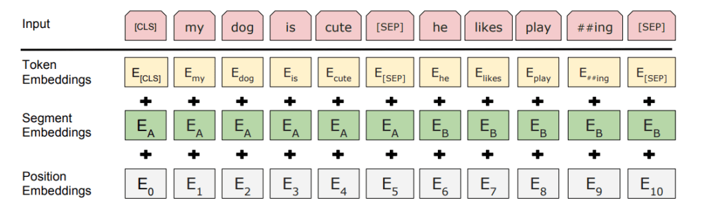

# Bolsistas_class_Jeanfranco
Gente, só precisan pegar os arquivos tsv e .ipynb no google colab e pronto!
# Interesting Reads:
* [Transformers from scratch](http://peterbloem.nl/blog/transformers?fbclid=IwAR2uQldWOByDAEa-EifEX0aVjFJXMfmnXhM0Ry6UaDIGP6jSdEw59Ro8UUM)
# First assignment
We use pre-trained BERT model to classify sentences. This model is relevant because we can use a new, more representative embedding. Specific, the input embeddings are the sum of the token embeddings, the segmentation embeddings and the position embeddings.

